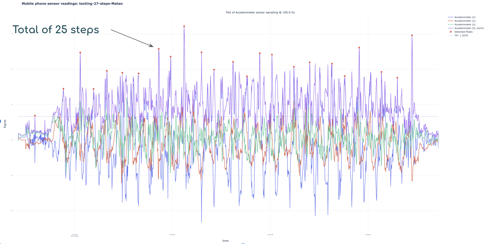

# A final project in Technion course 016832 - Navigation Systems

## Ido Glanz & Matan Weksler

---
### Repo consists of 2 main scripts/algorithms

1. An implementation of a PDR (Pedestrain Dead Reckoning) algorithm based on Kims' step length estimation
2. A vanilla implementation of dead reckoning on mobile phone IMU

## Installation
* Clone this repo
* Install the `requirements.txt` file attached

## Generating/obtaining data
* Install the [SensorLogger](https://www.tszheichoi.com/sensorlogger) app
* Save a dataset & export to the data folder of this repo
* Naming convention (to auto load params) is holding_pose-number of steps-username for example: `inhand-29-steps-Ido`
* Place data directory in the `/walking` directory of this repo and it will be loaded automatically

## Running the PDR algorithm:
* If running your own dataset, in file `PDR_Main.py` change the filename param to your file (directory) name
* Otherwise, just run `PDR_Main.py`

## Running the Dead Reckoning algo:
* If running your own data, change `dir_name` in `navigation_main.py` to your filename
* Run `navigation_main.py`

